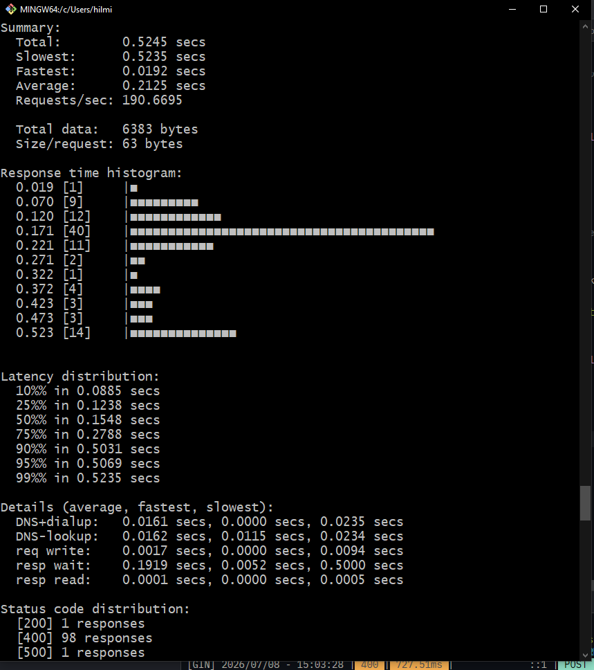
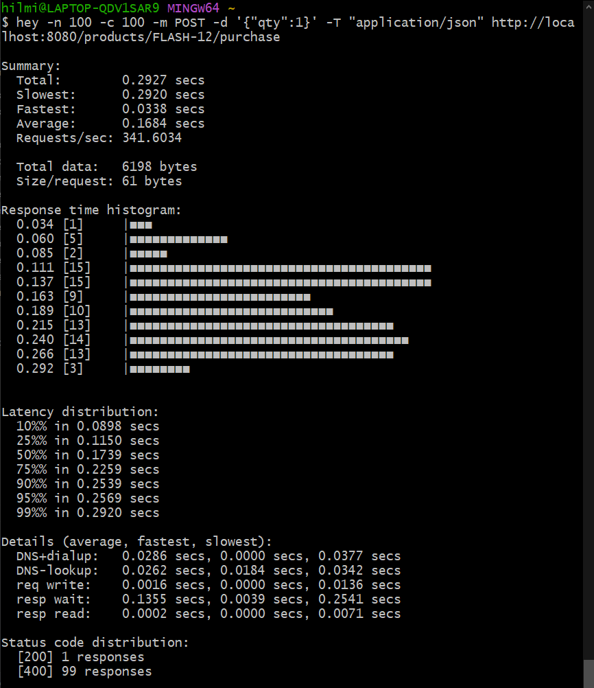

# BE Technical Test - Erajaya

Take-home test backend: Inventory Management (CRUD) dan endpoint Flash Sale
dengan penanganan high-concurrency. Dibangun dengan Go, Gin, GORM,
PostgreSQL, dan Redis.

## Tech Stack

- **Go** + **Gin** - HTTP framework
- **GORM** + **PostgreSQL** - Database dan ORM
- **Redis** - atomic stock decrement (Lua script) untuk endpoint flash sale
- **Sonyflake** - distributed unique ID generator (dipakai sebagai pengganti
  sequence/auto-increment)
- **shopspring/decimal** - presisi nilai uang (`price`), menghindari
  rounding error dari tipe `float`
- **golang-migrate** - schema migration

## How To Run

### Dengan Docker Compose (direkomendasikan)

```bash
docker compose up --build
```

Ini menjalankan Postgres, Redis, service migrasi, dan service API.

### Manual / lokal

```bash
cp .env.example .env
# isi kredensial DB dan Redis

make tidy         # update dependencies
make migrate-up   # jalankan migrasi database
make run          # jalankan API
```

API berjalan di `:8080`.

## Story 1 - Inventory Management (CRUD)

### Struktur tabel `products`

| Kolom | Tipe | Keterangan |
|---|---|---|
| `id` | `bigint` | Primary key, **bukan** sequence yang di-generate via Sonyflake di aplikasi sebelum insert |
| `sku` | `varchar(64)` | Unique, index, dipakai sebagai identifier di URL |
| `name` | `varchar(255)` | |
| `qty` | `int` | `CHECK (qty >= 0)` |
| `price` | `numeric(18,2)` | `CHECK (price > 0)`, dipetakan ke `decimal.Decimal` di Go |
| `created_at`, `updated_at` | `timestamptz` | |

### API Endpoints

| Method | Path | Deskripsi |
|---|---|---|
| POST | `/products` | Membuat produk baru |
| GET | `/products` | List semua produk |
| GET | `/products/{sku}` | Detail produk by SKU |
| PUT | `/products/{sku}` | Update produk (full replace) |
| DELETE | `/products/{sku}` | Hapus produk |

## Story 2 - Flash Sale Purchase
### Implementasi awal (Naif):
Implementasi ini menggunakan alur sebagai berikut:
```
FindBySKU (baca qty) → cek qty >= request (bandingkan qty) → qty -= request (kurangi qty) → Update DB
```
Implementasi ini sangat rentan oleh race condition, karena proses yang tidak atomic (baca-modifikasi-tulis) tidak aman dalam konteks multi-thread/multi-process. Ini membuat beberapa proses membaca qty yang sama sebelum transaksi lain belum sempat mengupdatenya di database.
Berikut merupakan hasil test menggunakan perintah `hey -n 100 -c 100`:


Dari 100 request, terdapat 1 request berhasil, 1 request internal server error, dan 98 bad request. Satu request internal server error ini menunjukkan terdapat 1 request yang lolos pengecekan sebelum request sukses, berhasil update qty di database (race condition). Namun tetap terjadi internal server error karena adanya constraint `CHECK (qty >= 0)` pada kolom `qty`.
Masalah ini bisa diatasi dengan melakukan atomic sql dengan memastikan jumlah qty dari produk cukup, bersamaan dengan query update. Namun hal ini menyebabkan banyak request yang langsung direct ke database. Oleh karena itu, diterapkan implementasi kedua dengan menambahkan layer Redis sebagai cache untuk menyimpan data qty.

### Implementasi Decrement dengan Redis + Lua Script:
Implementasi ini memanfaatkan Redis sebagai cache untuk menyimpan data qty. Endpoint purchase final menggunakan Redis sebagai gatekeeper di depan Postgres:
```
1. Request masuk → Lua script Redis mengecek dan mengurangi stock
   dalam satu operasi atomik (Redis single-threaded, sehingga tidak ada
   celah bagi request lain untuk menyelinap di antara cek dan tulis).
2. Jika stock tidak cukup → response gagal langsung, TIDAK PERNAH
   menyentuh Postgres sama sekali.
3. Jika berhasil → baru pada titik ini Postgres di-update
```
Berikut merupakan hasil test menggunakan perintah `hey -n 100 -c 100`:


Hasil dari pengujian tersebut menunjukkan bahwa hanya ada 1 request yang sukses dan sisanya mengalami bad request (insufficient stock). Implementasi ini tetap menjaga qty di database tidak negative karena hanya ada satu request sukses dan adanya constraint `CHECK (qty >= 0)` pada kolom `qty`.
